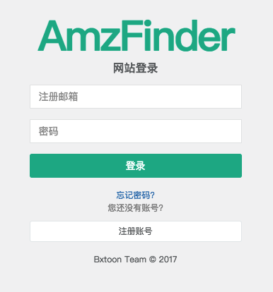

#### 注册账号

打开 AmzFinder 注册账号链接: [http://www.amzfinder.com/signup](http://www.amzfinder.com/signup)

在输入框内分别输入昵称、登录账号和不少于6位的密码，点击注册按钮，稍后你将注册成功，并自动切换到登录后的管理后台。

#### 账号登录

打开 AmzFinder 用户登录链接: [http://www.amzfinder.com/signin](http://www.amzfinder.com/signin)

在输入框内分别输入注册时账号和密码，点击登录按钮。

#### 修改密码

请先登录后台，点击后台上方导航条的“修改密码”按钮，输入新密码和重复输入一次密码。两次密码一致将修改成功。

#### 找回密码

在登录页面[http://www.amzfinder.com/signin](http://www.amzfinder.com/signin)，点击“忘记密码”链接，根据提示操作。操作之后稍后10分钟，重设密码链接将会发送到您注册账号的邮箱，如果10分钟邮件未在您的收件箱出现，请在邮箱的垃圾箱查找一下。

#### 账号充值

请先登录后台，点击后台上方导航条的“账号充值”按钮

用手机微信扫描屏幕中的二维码，添加好友后，发送 AmzFinder 注册账号和转账相应套餐的金额进行充值。充值成功后，你在账号充值页面可以看到您账号的到期时间。