#### 简易流程

#### 注册账号

打开 AmzFinder 注册账号链接: [http://www.amzfinder.com/signup](http://www.amzfinder.com/signup)

在输入框内分别输入昵称、登录账号和不少于6位的密码，点击注册按钮，稍后你将注册成功，并自动切换到登录后的管理后台。

#### 账号充值

请先登录后台，点击后台上方导航条的“账号充值”按钮

用手机微信扫描屏幕中的二维码，添加好友后，发送 AmzFinder 注册账号和转账相应套餐的金额进行充值。充值成功后，你在账号充值页面可以看到您账号的到期时间。

***注：目前加此微信账号是本网站唯一充值方式，其他方式请勿轻信，以免造成损失***

#### 添加店铺

请先登录后台，点击后台上方导航条的“店铺管理”按钮

点击搜索框右侧的“添加店铺”按钮，进入添加店铺页面

在下方填入相应的值，不同地区的录入之后可以一并提交。

更多帮助：[Seller ID，AWS Access Key ID 和 Secret Key 从哪里得到？](other.md#merchant-idaws-access-key-id-secret-key)

#### 安装客户端

安装客户端目的是在 Amazon 店铺后台获取 review 相关数据。

***温馨提示：为了防止店铺关联，请您将客户端安装在已登录过 Amazon 店铺后台的电脑安装客户端***

登录后台，在导航栏下载客户端

下载完成后，进入到下载目录，双击 AmzFinder.zip 解开压缩包。

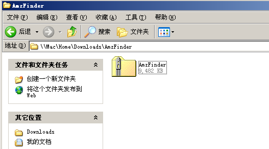

双击运行压缩包里面的 AmzFinder.exe 安装程序

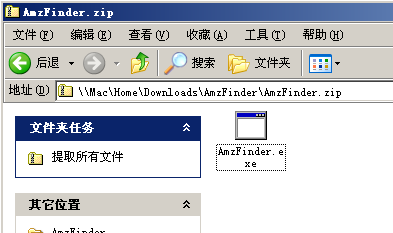

安装环境监测，如果您之前已经安装过了必要的环境，安装向导会自动跳到安装 AmzFinder 界面

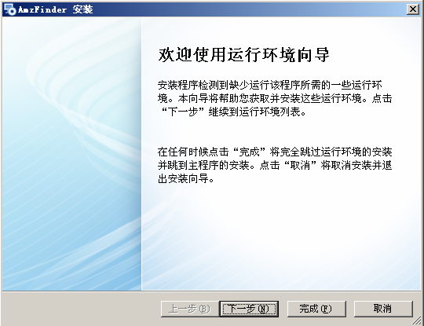

勾选 .NET Framework 4.0 点击 “下一步” 按钮

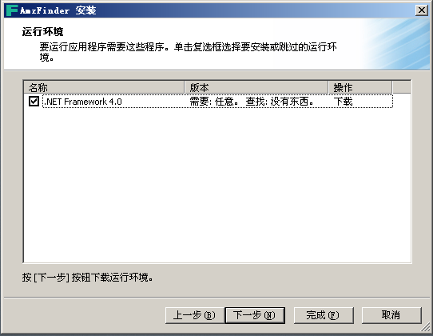

开始下载环境包，稍后片刻，等待下载完成点击 “下一步” 按钮

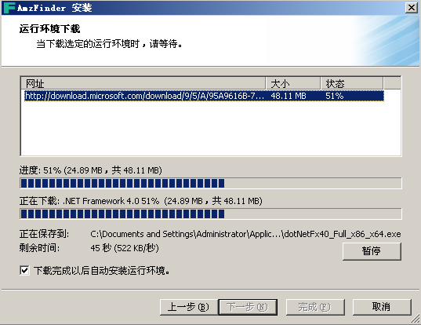

开始解压环境包，待解压完成后，点击 “下一步” 按钮

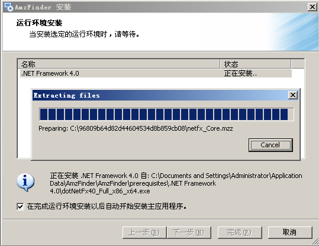

勾选 "我已阅读并接受条款(A)" 点击 “安装” 按钮

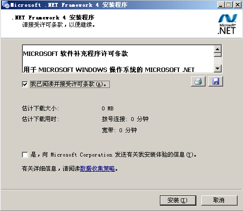

开始安装软件运行环境，需要稍候一段时间。

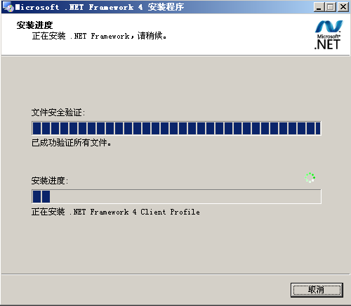

最后安装环境完成

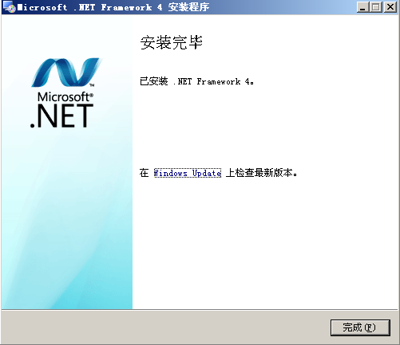

安装 AmzFinder 界面，点击 “下一步” 按钮

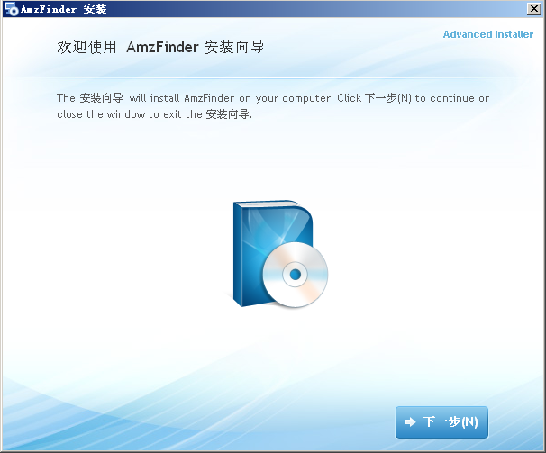

点击 “Install Now" 开始安装，等待安装进度条完成

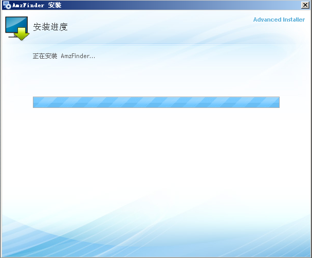

点击 “启动 AmzFinder” 启动客户端

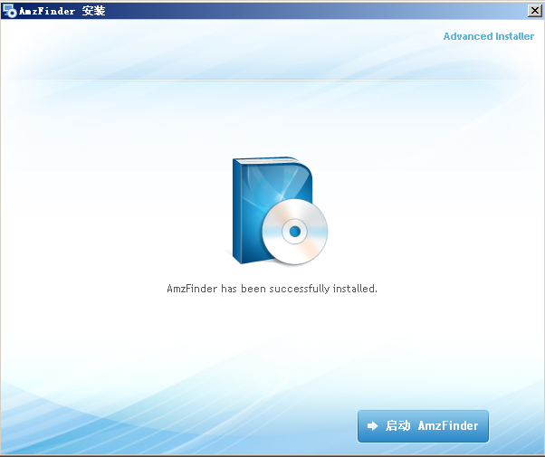

同时桌面将会产生一个 AmzFinder 图标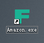，下次可以在桌面直接运行

软件启动后，点击下图齿轮按钮，添加店铺信息

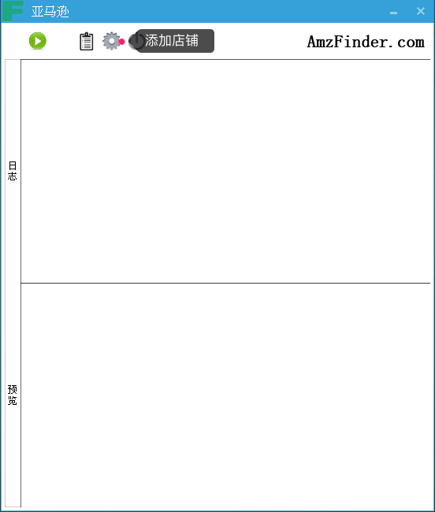

选择 Amazon 区域，勾选亚马逊站点，输入 Amazon 账号 和 密码，点击 “保存” 按钮，如果本机可以登录多个店铺，重复这个步骤

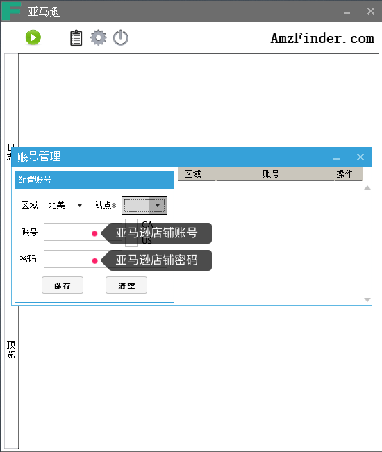

保存好店铺信息点击 "手动运行" 按钮，将开始上报 review 信息。

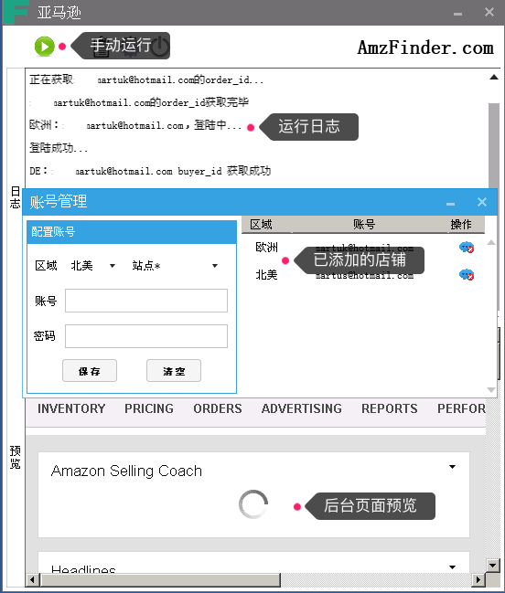

好了，恭喜您已经准备就绪，开始享受 AmzFinder 给您带来的便利吧。最后，您可以每天运行一次或者挂着客户端，程序会自动定时上报 review 信息。

