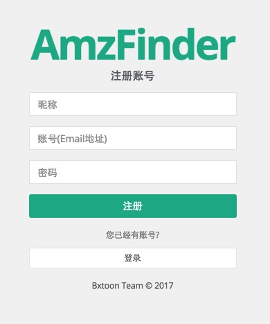
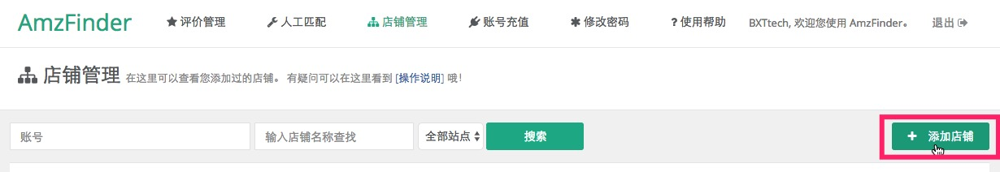
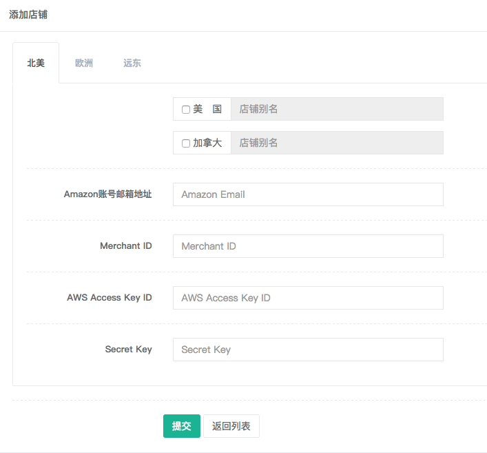

#### 注册账号

打开 AmzFinder 注册账号链接: [http://amzfinder.com/signup](http://amzfinder.com/signup)

在输入框内分别输入昵称、登录账号和不少于6位的密码，点击注册按钮，稍后你将注册成功，并自动切换到登录后的管理后台。

#### 账号充值

请先登录后台，点击后台上方导航条的“账号充值”按钮

用手机微信扫描屏幕中的二维码，添加好友后，发送 AmzFinder 注册账号和转账相应套餐的金额进行充值。充值成功后，你在账号充值页面可以看到您账号的到期时间。

#### 添加店铺

请先登录后台，点击后台上方导航条的“店铺管理”按钮

点击搜索框右侧的“添加店铺”按钮，进入添加店铺页面

在下方填入相应的值，不同地区的录入之后可以一并提交。

更多帮助：[Seller ID，Access Key Id 和 Secret Key 从哪里得到？](http://link)

#### 安装客户端

待完善

